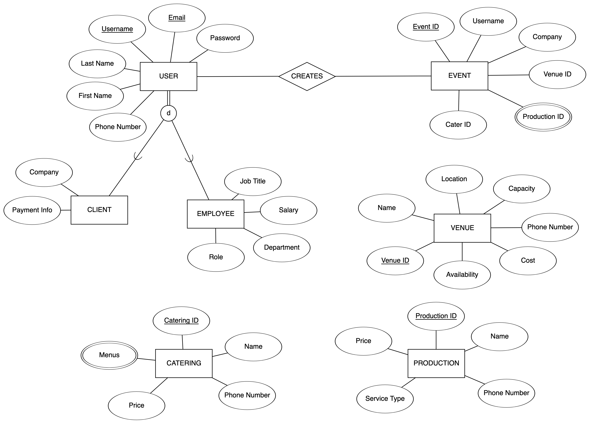

<<<<<<< HEAD
# Event Management App

This event management app is designed to help users create and manage events, select venues, and coordinate catering and production services. The app includes features for user management, event creation, venue selection, and service provider selection.
Features

User Management: The app includes a User entity that can be either an Employee or a Client. Clients can create and manage events, while Employees can perform administrative tasks such as approving events and managing service providers.

Event Creation: The app allows clients to create and manage events, including selecting the date, time, location, and other details. Clients can also specify catering and production needs for each event.

Venue Selection: The app includes a Venues entity that provides information about various event venues, including their address, capacity, availability, rental fee, amenities, parking, rating, and restrictions. Clients can select a venue that meets their needs and preferences.

Catering and Production Services: The app includes entities for Catering and Production providers, each with information about their offered services, equipment inventory, portfolios, ratings, and price ranges. Clients can select one or more providers to meet their catering and production needs for each event.

## ER Diagram

The ER diagram for the app includes entities for Users, Employees, Clients, Events, Venues, Catering providers, and Production providers. The relationships between these entities are managed through foreign key relationships.

Click here to see ER Diagram

## Technologies Used

The app is built using the following technologies and frameworks:

- [insert technology or framework here]
- [insert technology or framework here]
- [insert technology or framework here]

## Installation

To install and run the app, follow these steps:

### `npm start`

Runs the app in the development mode.\
Open [http://localhost:3000](http://localhost:3000) to view it in your browser.

The page will reload when you make changes.\
You may also see any lint errors in the console.

### `npm test`

Launches the test runner in the interactive watch mode.\
See the section about [running tests](https://facebook.github.io/create-react-app/docs/running-tests) for more information.

### `npm run build`

Builds the app for production to the `build` folder.\
It correctly bundles React in production mode and optimizes the build for the best performance.

The build is minified and the filenames include the hashes.\
Your app is ready to be deployed!

See the section about [deployment](https://facebook.github.io/create-react-app/docs/deployment) for more information.

### `npm run eject`

**Note: this is a one-way operation. Once you `eject`, you can't go back!**

If you aren't satisfied with the build tool and configuration choices, you can `eject` at any time. This command will remove the single build dependency from your project.

Instead, it will copy all the configuration files and the transitive dependencies (webpack, Babel, ESLint, etc) right into your project so you have full control over them. All of the commands except `eject` will still work, but they will point to the copied scripts so you can tweak them. At this point you're on your own.

You don't have to ever use `eject`. The curated feature set is suitable for small and middle deployments, and you shouldn't feel obligated to use this feature. However we understand that this tool wouldn't be useful if you couldn't customize it when you are ready for it.

## Usage

To use the app, follow these steps:

- [insert usage step here]
- [insert usage step here]
- [insert usage step here]

## Contributors

This app was developed by [insert contributor names here]. If you have any feedback or suggestions, please contact us at [insert contact email here].